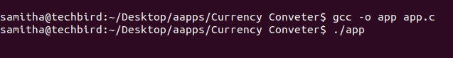

# Simple-Currency-Converter-with-C
Simple currency converter program by using C programming

This document shows how to compile and run this C program on Ubuntu Linux using the **gcc compiler**. Please follow these simple steps.

## Run on Ubuntu OS

1. Open your clone folder. 
2. Right click & select **Open Terminal**. 
3. Now your terminal path is set to your app location.
4. Type this command to compile app.c. 
```
gcc -o app app.c
```
5. After that press enter key and type below command to run your C programme.
```
./app
```



## App Summery

Maianly I focused in this simple interest calculator app with main two parts.
1. Sri Lankan Rupees to US Dollars / AUS Dollars / ITL Lira / UK Pound sterling / Bahraini dinar 
2. US Dollars / AUS Dollars / ITL Lira / UK Pound sterling / Bahraini dinar to Sri Lankan Rupees

- User can select what currency he/she want to convert.
- Then after that user can input the **first currency**
- Final displays the converted currency.


